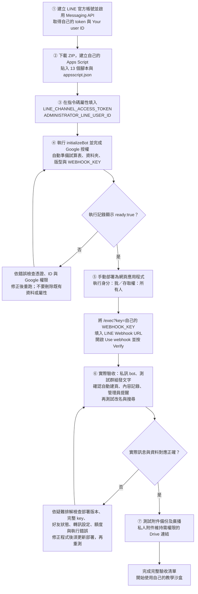

# 學生從下載到部署

適用於自己的教學沙盒，請用假資料及獨立測試群組。程式不會使用老師的正式試算表或資料夾。

## 安裝流程圖

圖中的 **①–⑦ 對應下方第 1–7 節**。先完成上一個檢查點，再往下操作；不需要複製老師的試算表或建立 `templet`。



**三個容易混淆的地方：**

- 第 ② 步二選一：獨立 Apps Script 會在初始化時建立試算表；從自己的空白試算表開啟 Apps Script，則使用該試算表。
- 儲存程式 ≠ 部署；LINE 的 Verify 通過 ≠ 實際記錄、轉訊與廣播皆正常。
- 群組第一則訊息才會建立對應頁籤及子資料夾；只是邀 bot 入群還不會建立。

若下載後的文字編輯器沒有顯示圖，請在 GitHub 開啟本頁，或依下方編號逐步操作。

## 1. 建立自己的 LINE 官方帳號

1. 建立 LINE Official Account，在 **LINE Official Account Manager → 設定 → Messaging API** 啟用 Messaging API 並選擇自己的 Provider。
2. 使用同一帳號進入 LINE Developers Console，開啟剛建立的 Messaging API Channel。
3. 在 Messaging API 頁面取得 channel access token。
4. 在 Basic settings 找到 **Your user ID**，作為管理員 ID。不是 Channel ID，也不是 LINE 暱稱。
5. 將 bot 加為好友。若要放入群組，允許 bot 加入群組；稍後邀入測試群組。
6. 關閉可能造成重複回覆的自動回覆／歡迎訊息，並在安裝完成後啟用 webhook。

目前不是從 LINE Developers Console 直接新建 Messaging API Channel。
依據：[LINE 官方建立流程](https://developers.line.biz/en/docs/messaging-api/getting-started/)。

## 2. 下載並建立自己的 Apps Script

不需要 Node.js 的方法：

1. 在本 repo 點 **Code → Download ZIP**，解壓縮。
2. 到 [Apps Script](https://script.google.com/home) 建立全新專案，例如「My LearningBot」。
3. 將 `src/` 內全部 **13 個 .js 檔**依相同檔名建立為 GAS 腳本並貼上內容。GAS 編輯器會使用 .gs 副檔名；例如 `setup.js` 對應 `setup.gs`。每個檔案只放一次。
4. 不要上傳 `tests/`、package.json 或文件。預設 Code.gs 可保留空白，不要再放另一份 doPost。
5. 專案設定勾選顯示 `appsscript.json`，將本 repo 的 `src/appsscript.json` 內容貼入。
6. 儲存全部檔案。

也可以在**自己新建的空白試算表 → 擴充功能 → Apps Script**建立綁定式專案，再進行相同步驟。
兩種方法二選一；不要另外複製老師的試算表。

使用命令列的同學可參考文末可選流程。

## 3. 設定自己的憑證

在「專案設定 → 指令碼屬性」手動新增：

- `LINE_CHANNEL_ACCESS_TOKEN`：你的 token。
- `ADMINISTRATOR_LINE_USER_ID`：你的 Your user ID。

其他設定初次可留白，詳見 [CONFIG.example.md](../CONFIG.example.md)。
不可填老師的任何 ID，也不可把 token 傳到 LINE 或提交到 GitHub。

## 4. 執行 initializeBot

1. 在函式選單選擇 `initializeBot`，按執行。
2. 授權自己的 Google 帳號使用試算表、Drive、外部請求及觸發器。只對自己確認過的原始碼授權。
3. 成功記錄應包含 `ready:true` 及你的試算表網址。

此步驟會：

- 檢查 token 及管理員 ID 格式。
- 建立私人上傳根資料夾；若指定自己的資料夾則使用該資料夾。
- 獨立專案建立一份試算表；綁定式專案使用原本空白試算表。
- 用程式建立管理員頁的欄位、控制列、配色，以及改名同步觸發器。
- 建立私人 `WEBHOOK_KEY`。

**不用手工建立 templet、Triggers 或 Learning Center。**預設的「工作表1」可以保留，程式會略過非管理頁。
初始化可重跑，不會清除已記錄的內容；不要以刪除資料或 Script Properties 作為重試方式。

若學校 Google Workspace 禁止授權、外部服務或匿名網頁應用程式，請洽管理員或使用課程允許的其他帳號，不要繞過學校政策。

## 5. 自行部署並設定 webhook

1. Apps Script → 部署 → 新增部署作業 → 網頁應用程式。
2. 執行身分「我」，存取權「所有人」（LINE 伺服器不能登入 Google）。
3. 完成後複製結尾為 `/exec` 的網址，不要使用 `/dev`。
4. 到指令碼屬性複製 `WEBHOOK_KEY`，組合成：

```text
你的 /exec 網址?key=你自己的 WEBHOOK_KEY
```

5. 將**完整網址**填入 LINE Developers → Messaging API → Webhook URL，開啟 Use webhook。
6. 按 Verify，再依下一節傳送實際訊息驗收。

密鑰與完整網址不要公開、截圖或放進 repo；它們是通行憑證。
Verify 只代表連線檢查，不能取代下列驗收。缺少 key 時程式不寫入，即使 Google 傳輸層回應成功也不表示 bot 已可運作。
Apps Script 請求參數及部署說明：[Google 官方文件](https://developers.google.com/apps-script/guides/web)。

## 6. 第一次使用

1. 私訊 bot「備份」，確認有選單。
2. 邀 bot 加入你的測試群組，取得成員同意後，發一則一般文字。
3. 新群組的**第一則訊息**會建立新的工作表及子資料夾，不是加入群組事件本身就會建立。
4. 表單從第 9 列記錄內容；管理員私訊應收到群組來源卡片。
5. 在該群組輸入 `//取名我的測試群組`，或由自己在試算表修改 A3／頁籤名稱。
6. 確認頁籤、A3、Drive 子資料夾名稱一致，舊的 sheetId、A4 與紀錄未換掉。
7. 使用 `//檔案` 的瀏覽及搜尋按鈕；輸入搜尋字串不是新增一筆內容。

一般文字不一定有群組內回覆；請看表單紀錄與管理員私訊，不要只用「群組沒回話」判定失敗。
管理員自己與 bot 的私訊不會再回送一張提醒給自己。

新群組預設即時轉訊；`//轉訊` 可設定暫停或定時。其他群組不會因設定一個群組而全部改變。

## 7. 附件與廣播

- 上傳圖片／檔案後，先確認 Drive 確實存在、表單顯示已備份。
- 新資料夾預設私人。圖片、影片、音訊若沒有公開讀取權限，程式會傳送受權限保護的 Drive 連結；收件人須以獲授權的 Google 帳號開啟。
- 若要直接在 LINE 顯示圖片，擁有者須自行決定將該媒體設為「知道連結的任何人」可讀。這代表持有連結者可讀，**不可用於敏感學生資料**。學校可能禁止此設定。
- 程式不會自動公開根資料夾或附件。LINE／Drive 仍可能有格式、大小、下載政策或額度限制。
- 貼圖只能使用 [Messaging API 支援清單](https://developers.line.biz/en/docs/messaging-api/sticker-list/)中的項目；不是所有商店購買貼圖都能由 bot 重送。
- 管理員私訊 `//廣播`，選自己的目標群組，輸入最多五則內容，按檢視再確認。失敗時閱讀實際錯誤；不要連續按舊確認重送。

完成 [完整驗收清單](TESTING.md) 後，再提供同學測試。

## 更新既有安裝

1. 先備份自己的程式與試算表。
2. 更新所有 src 腳本，保留自己的 Script Properties。
3. 從舊版首次升級需執行 initializeBot，補齊初始化設定與觸發器；內容欄位在寫入時檢查及補齊。在建立新 webhook 前確認完整 key。
4. Apps Script → 部署 → 管理部署作業 → 編輯現有部署 → 新版本 → 部署。沿用同一部署通常保持 /exec URL；保留原 key 參數。
5. 再跑驗收清單。只按儲存不會更新現有版本化部署。

本版不會猜測「已自行改名、卻沒有固定 ID 對照」的舊頁籤。這種既有資料請先人工核對，不要直接重建或刪除。
原始以 LINE ID 命名的舊頁可先用 previewReadableNames 檢查，再 registerReadableNames／initializeReadableNames 建立對照；操作前一定備份。

## 可選：clasp 上傳

主要流程不需要此工具。使用 Node.js 20+，以下固定以 clasp 3.4.1 說明：

```bash
git clone https://github.com/canlgz/LearningBot-Legacy.git
cd LearningBot-Legacy
npm test
npm install --global @google/clasp@3.4.1
clasp login
```

先在網頁建立自己的 Apps Script，在專案設定取得 Script ID。
把 repo 的 `.clasp.example.json` 複製為本機 `.clasp.json`，將 scriptId 換成自己的值；rootDir 保持 src。
在 Apps Script 使用者設定中，依 Google 要求允許 Apps Script API，再執行：

```bash
clasp show-file-status
clasp push
clasp open-script
```

先確認清單只有 src 內的檔案，且 Script ID 是自己的空白專案，才 push；不得對老師的專案執行。
clasp push 上傳原碼，不等於部署。接續第 3–7 節，由你在網頁完成授權、初始化與部署。
參考：[clasp 官方文件](https://github.com/google/clasp)。

## 疑難排解

| 現象 | 檢查 |
| --- | --- |
| 初始化缺少設定 | 核對兩個必填鍵；管理員必須是 U 開頭的真正 user ID |
| Verify 通過但沒資料 | 確認 /exec、?key、Use webhook、最新部署、initializeBot 成功，並查看執行錯誤 |
| 改名後沒同步 | initializeBot 是否完成兩個名稱同步觸發器；A4 是否被誤改；Drive 是否可寫 |
| 有記錄但無即時提醒 | A5 是否為 0；管理員是否已加 bot 好友／未封鎖；額度是否用完 |
| 圖片顯示成連結 | 私人附件的預設安全行為，不是備份失敗 |
| 按舊廣播確認無效 | 重新開始一次廣播，不要自動重送未知結果的草稿 |
| 新群組重複建立或找不到 | 不要刪除固定 ID properties；先保留資料並檢查 registry／A4 |
